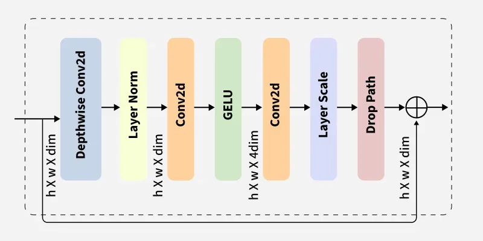

# Alzheimer's Disease Classification using ConvNeXt

## Overview

## Dataset Overview
Dataset File Tree

AD_NC
AD_NC\test
AD_NC\train
AD_NC\test\AD
AD_NC\test\NC
AD_NC\train\AD
AD_NC\train\NC
meta_data_with_label.json

the AD folders contain images (jpeg) of MRI scans classified with alzheimers disease, while NC contains normal cognition

the sizes of the images are outputted as follows:
(256, 240)    30520
Name: count, dtype: int64

## Algorithm Description

ConvNeXt is structured combining aspects of convolutional neural networks (CNNs), as well as successful elements from Vision Transformers (ViTs).

This can be seen below

ConvNeXt block:
