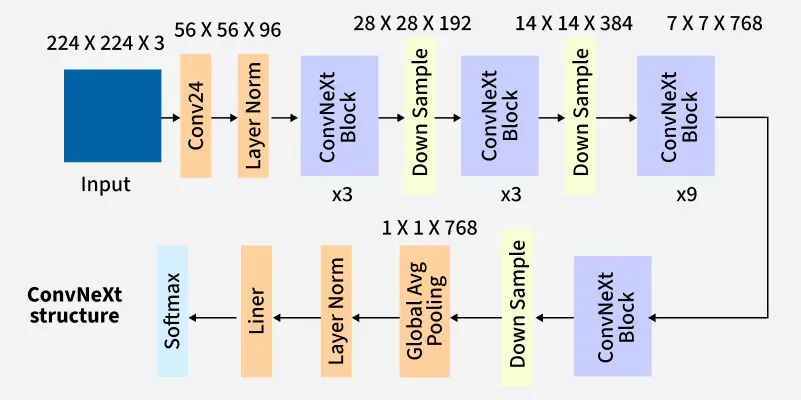
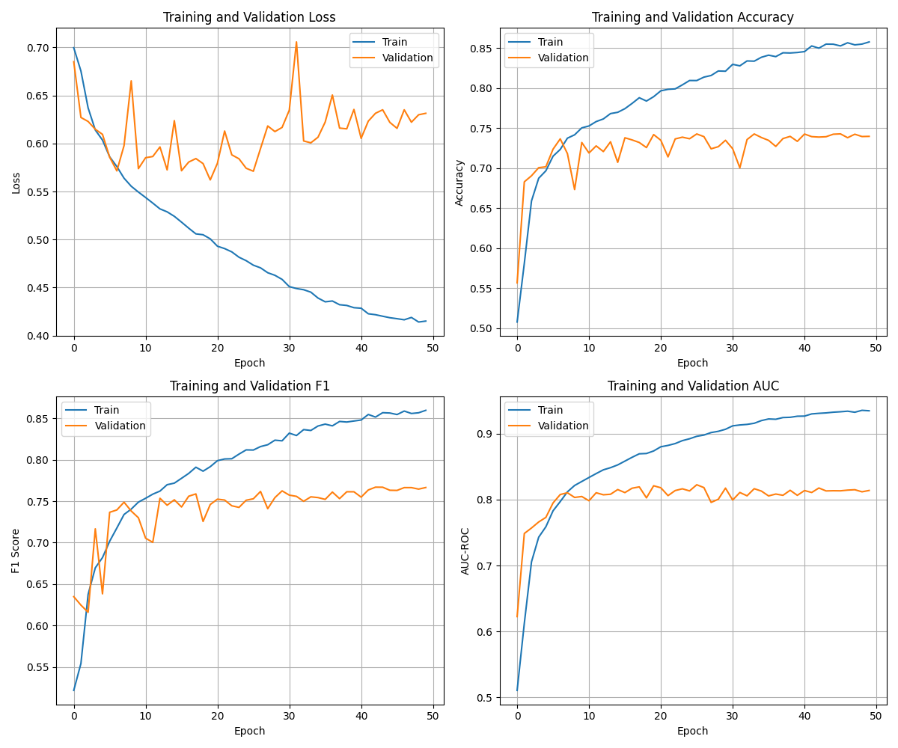
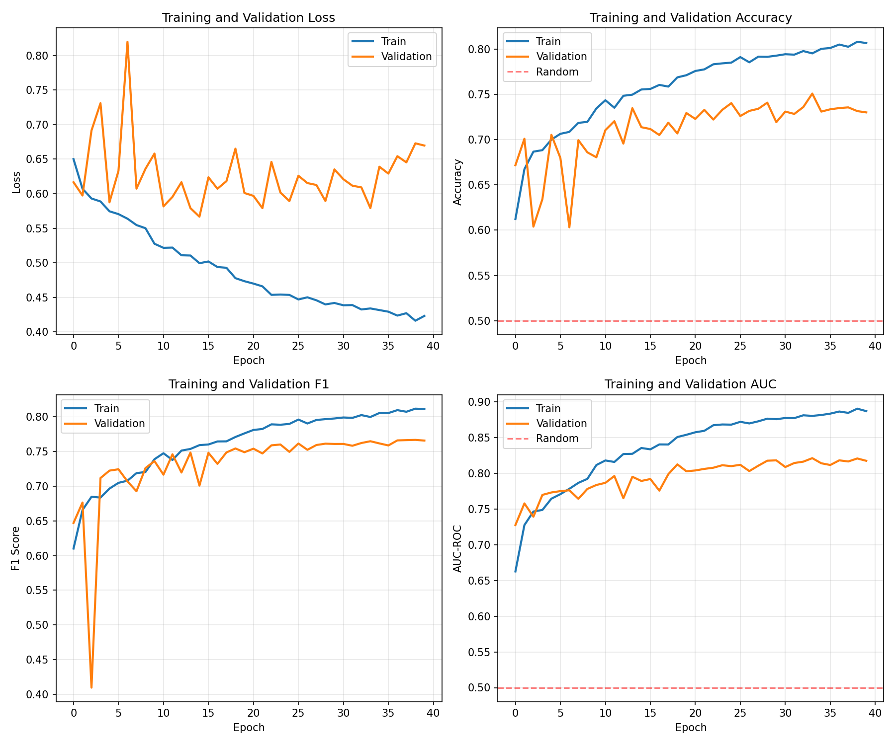
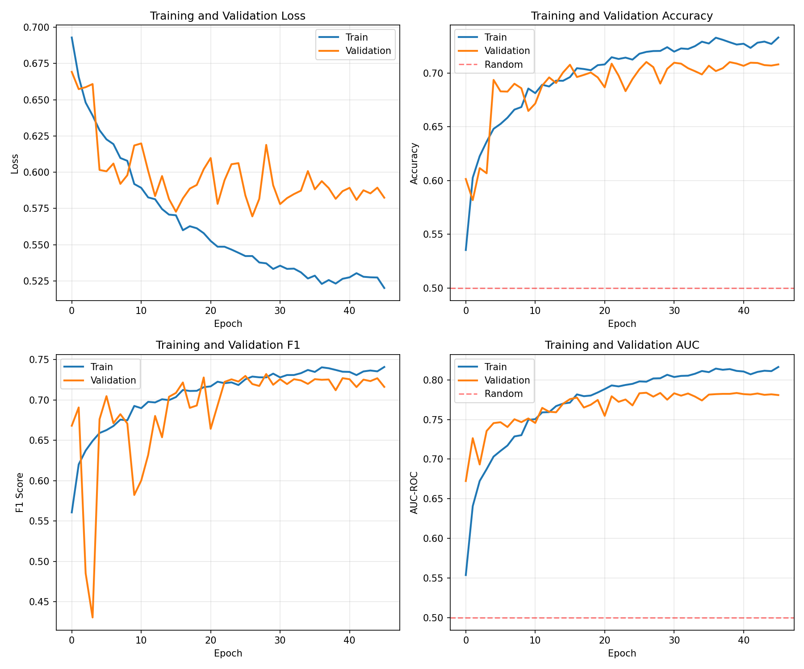

# Alzheimer's Disease Classification using ConvNeXt

## Project Description
This project focuses on classifying Alzheimer's disease (AD) as well as normal cognition brain scans (NC) using MRI data from the alzheimer's disease neuroimaging initiative (ADNI) dataset. This task was attempted using a ConvNeXt convolutional neural network (CNN), a modern architecture able to achieve excellent performance on image recognition tasks while keeping efficiency.

## Model Architecture

ConvNeXt is structured combining aspects of convolutional neural networks (CNNs), as well as successful elements from Vision Transformers (ViTs). This is done through several innovations, namely the patchify stem which uses a 4x4 (stride 4) convolution rather than a 7x7 as the first stage, resembling the patches of ViTs.
The network also uses GELU activations instead of ReLU, and Layer in in place of Batch Normalisation [1]

The full ConvNeXt architecture can be seen below:



This shows several other key innovations in ConvNeXt, namely the four stage structure of ConvNeXt blocks.

### ConvNeXt Block

The ConvNeXt block is defined as seen below:


### ConvNeXt class

In `modules.py`, the class is defined with a stem, stages, normalisation and head. This performs operations in the following stages:

1. The stem performs Conv2d and LayerNorm2d
2. Stages perform downsampling and then apply a ConvNeXt block (no downsample on first layer)
    1. In the ConvNeXt block, first a depthwise conv is performed (Conv2d(groups=dim))
    2. LayerNorm2d: Applies layer normalisation over mini-batch
    3. Conv2d: Applies 2d convolution over input signal
    4. GELU: Gaussian Error Linear units function
    5. Conv2d
    6. Layer Scale: learnable scaling parameter
    7. Drop path: stochastic depth, drops entire residual connections
3. LayerNorm2d
4. Linear: final classification layer

## Dataset Overview
The image dataset is split as seen in the below file tree

```text
AD_NC  
├── test  
│   ├── AD  
│   └── NC  
└── train  
    ├── AD  
    └── NC  
```

the AD folders contain images (jpeg) of MRI scans classified with alzheimers disease, while NC contains normal cognition
These are present in both test and train folders, and represent the 2 classes for the data. 

There are a total of 21520 training images, and 9000 testing images.
For a ConvNeXt architecture, this is a relatively small dataset, as the ConvNeXt models seen in [1] were trained using Imagenet22k or Imagenet1k [3] which contain over 1 million images for the training dataset. Therefore model size may have to be reduced, using one of the smaller sizes (e.g. ConvNeXt small, ConvNeXt tiny) or a custom size.

the sizes of the images are as follows:
```
(256, 240)    30520
Name: count, dtype: int64
```
This shows uniform sizes across all images, making dataset preprocessing much easier and removes the need for cropping, squishing, or padding of images.

Split of classes:
```
[10400 11120] - Train
[4460 4540] - Test
```
This is a very well balanced dataset, and class weights can probably be ignored for the loss function. 
Considering this classification problem, cross entropy loss will be used as this loss function.

### Data augmentation
To improve generalisation and reduce overfitting from the model, data augmentation techniques were applied to the training set before training.
These were performed as follows. These represent noise that may be present in actual MRI images for training as explained below:

* Horizontal flip - used as images may be flipped in test set
* Rotation - used as images may be oriented differently
* Colour Jitter - used to brighten sections of MRI for noise
* Affine - used as scale may change across images
* Gaussian Blur - used as resolution may change or sections may be blurred

These augmentations change the images loaded and allow for a much more regularised training, due to the smaller dataset used.
## Training
To train the ConvNeXt model, the following command is used:

```python train.py [--checkpoint checkpoint_path]```

This trains the model on the ADNI dataset, saving the model as checkpoints to ```/checkpoints/{model name}```. If the checkpoint argument is included, this resumes training from the specified checkpoint.
The training script additionally saves a confusion matrix and training results images to the save directory

### Additions
the training uses the AdamW optimiser, a version of the Adam optimiser where weight decay does not accumulate in the momentum nor variance [2]. A learning rate scheduler is also used, which changes the learning rate according to a cosine function to improve the chance of optimal gradient descent.

## Predicting
To predict results with the ConvNeXt model, this can be done using the following command.

`python predict.py [--model model_name] [--output output_path]`

Where model is required, and output can be specified to define where the json of prediction results will be saved.
These generated results include a confusion matrix, as well as the predictions made for each image. These results also include a report on successful predictions, and per class prediction statistics.
## Results
### Early Results
The first model was 
Initial Training of the model resulted in validation accuracies of <80%, peaking at around 74% due to luck in the gradient descent. This was due to overfitting of the training set, which can be seen looking at the epochs over training.



This shows training accuracy continuing to rise while validation accuracy fluctuates, after less than 10 epochs. This shows clear overfitting, while the training set was able to reach the desired accuracy, meaning training the model was able to be done successfully, but parameters needed tuning. To fix this, several attempts were made through increasing regularisation techniques.

Firstly drop_path rate was increased, which did not have a strong enough impact to reduce the effects without stopping learning.

Next, a dropout was added before the linear head. This regularises the features going into this final classification layer by randomely zeroing some of the elements of the input. 

A weight decay was also added, which adds a penalty to the loss function based on the model's weights. These both were done to help improve generalisation toward new data. 

Next mixup augmentation was implemented, which mixes up the features and corresponding labels with a probability.

Going forward, this allowed for a slightly larger model to be used. This model was defined with `depths=[3, 3, 27, 3], dims=[128, 256, 512, 1024]`, corresponding to dimensions used in [1] for convnext_base, however training still overfitted after reaching over 70% accuracy on the validation set, but allowing the training set accuracy to reach over 98% due to the larger model size. 

Model size was again reduced from these findings, however from here the regularisation added had been too strong, preventing the model from beginning training, always predicting at a random chance, with the loss also matching random chance for binary classification (~0.693).

This meant some regularisation had to be dropped, which started with the mixup, and some train augmentations. This allowed to model to train again, with less harsh overfitting than seen in previous training. The next training achieved a much greater stability after getting started, but had a large amount of instability likely due to high learning rate for the first few epochs. Due to the large amount of regularisation this reached an accuracy of ~74%. This can be seen below in the training history.




### Final Results
The final model was a custom size, made slightly larger than the ConvNeXt tiny and smaller than the ConvNeXt small seen in [1]. This was done to allow for the higher accuracy of the larger model while minimising overfitting. This used the following parameters: `depths=[3,3, 9, 3],dims=[72, 144, 288, 576]`

Training History 1

Training History 2


This model trained to a final accuracy of 76.53%, after stabilising. This was done in two seperate training sessions as seen above. While this does not achieve the desired 80% accuracy, due to time and data constraints this was the best able to be achieved. The summarised prediction results as well a confusion matrix can be seen below


| Class | Precision | Recall | F1-Score | Support |
|-------|-----------|--------|----------|---------|
| AD    | 0.7899    | 0.7173 | 0.7518   | 4460    |
| NC    | 0.7453    | 0.8126 | 0.7774   | 4540    |

## References
[1] Liu, Z., Mao, H., Wu, C.-Y., Feichtenhofer, C., Darrell, T. and Xie, S. (2022). A ConvNet for the 2020s. [online] Available at: https://arxiv.org/pdf/2201.03545.

[2] Pytorch.org. (2024). AdamW — PyTorch 2.7 documentation. [online] Available at: https://docs.pytorch.org/docs/stable/generated/torch.optim.AdamW.html.

[3] ImageNet22K. (2024). Service.tib.eu. [online] doi:https://doi.org/10.57702/64os2kgo.